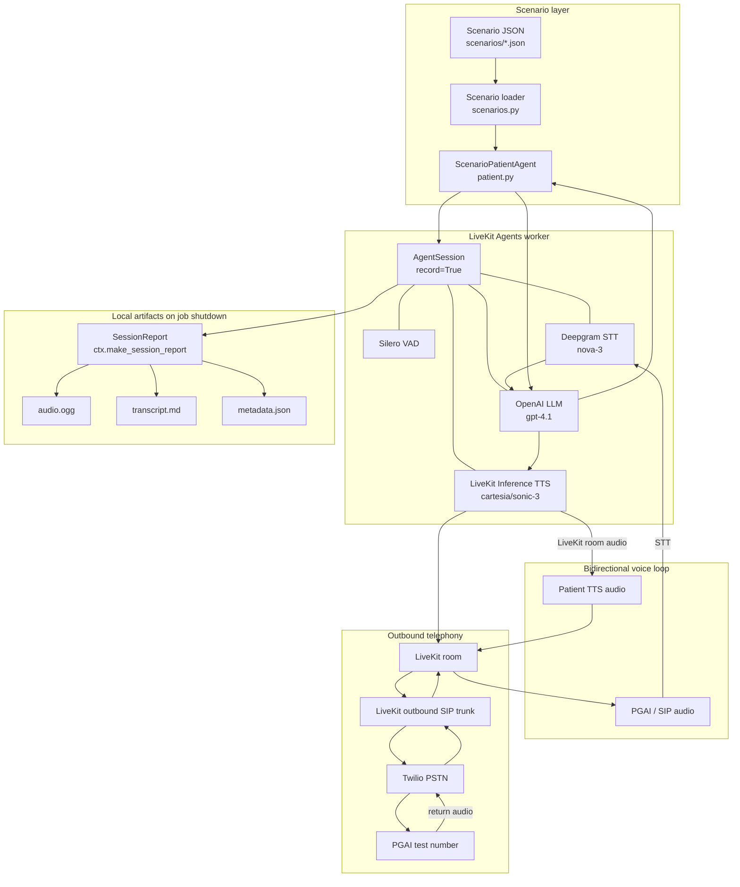

# Architecture

Technical overview of the Pretty Good AI (PGAI) voice-agent testing harness for challenge review.

## System purpose

This repository is an **autonomous AI patient simulator**. It places real outbound PSTN calls to Pretty Good AI’s healthcare voice agent and stays in character as a fictional patient for the duration of the call.

Roles are intentionally reversed from a typical voice-agent demo:

| Actor | Role |
|---|---|
| **PGAI** | System under test (healthcare clinic agent on the phone) |
| **`ScenarioPatientAgent`** | Test actor (patient simulator driven by scenario JSON) |

The harness does not judge clinical correctness in-process. It drives scenario behavior, records the call, persists transcripts, and leaves bug adjudication to human review ([`bugs/BUG_REPORT.md`](bugs/BUG_REPORT.md)).

---

## High-level architecture



Nothing outside this graph is required for a call: no database, no dashboard, no hosted realtime speech-to-speech model.

---

## Component responsibilities

Only modules that exist under `src/pgai_voice_agent_tester/`:

| Module | Responsibility |
|---|---|
| **`__main__.py`** | Re-exports `server` and `main` so LiveKit CLI (`lk agent …`) can discover the `AgentServer`. |
| **`__init__.py`** | Defines `AgentServer`, `@server.rtc_session(agent_name="pgai-patient")` entrypoint, builds `AgentSession` (VAD/STT/LLM/TTS), enables `record=True`, registers shutdown callback to persist artifacts. |
| **`agent_config.py`** | Shared constant `LIVEKIT_AGENT_NAME = "pgai-patient"` used by worker registration and outbound dispatch. |
| **`scenarios.py`** | Loads/validates scenario JSON into frozen `Scenario` dataclasses; `load_scenario`, `list_scenarios`, `ScenarioError`. |
| **`patient.py`** | Persona instructions, `ScenarioPatientAgent`, progressive beat gating, `utterance_satisfies_beat()`, scenario selection from job metadata / env / fallback, Jordan Hale fallback agent. |
| **`outbound.py`** | One-shot dialer: create room → dispatch agent with metadata → `CreateSIPParticipantRequest`; CLI `--scenario` / `--to` / `--from-number` / `--trunk-id` / `--room`. |
| **`call_artifacts.py`** | Copies session recording, renders `transcript.md`, writes `metadata.json` under `calls/<room_name>/`. |

There is no `config.py` or `logging_config.py` in this repository; environment loading uses `python-dotenv` (`load_dotenv()`) in the worker and outbound entrypoints.

---

## Scenario engine

### JSON definitions

Scenarios live in `scenarios/*.json`. Required fields (`scenarios.py`):

- `id`, `name`, `goal`
- `patient` (non-empty object of patient facts)
- `conversation_beats` (non-empty ordered list of objective strings)
- `observations`, `metadata`

Ten scenarios ship with the repo (`01_routine_appointment` … `10_safety_escalation`).

### Progressive disclosure

`ScenarioPatientAgent` keeps a per-agent `beat_index` (starts at `0`).

`build_patient_instructions(scenario, beat_index=…)` exposes:

- full patient profile facts
- already-completed beats as “Already covered earlier”
- **only the current objective**

Later beats are omitted from the LLM prompt so the model cannot skip ahead and volunteer future facts (preferred times, mid-call detail changes, safety symptoms, etc.).

### Deterministic advancement

Advancement is **not** an LLM tool.

1. On `conversation_item_added`, the agent listens for completed **assistant** (patient) messages.
2. `utterance_satisfies_beat(utterance, current_beat, patient)` decides whether the utterance covers the current beat (quoted phrases, name+DOB, end-call markers, or factual evidence groups for days/times/doctor names/etc.).
3. Under an asyncio lock, the beat is re-checked, then `advance_beat()` increments `beat_index` by at most one and calls `update_instructions(...)` with rebuilt instructions.

Maximum advancement per qualifying patient utterance: **one beat**.

---

## Scenario selection and dispatch

Precedence in `resolve_scenario_selection()`:

1. **LiveKit job / dispatch metadata** — JSON `{"scenario_id":"<id>"}` (highest priority)
2. **`PGAI_SCENARIO_ID`** environment variable
3. **Fallback** — Jordan Hale static persona (`PATIENT_INSTRUCTIONS`) when neither is set

Outbound CLI:

```bash
uv run python -m pgai_voice_agent_tester.outbound --scenario 01_routine_appointment
```

`encode_scenario_dispatch_metadata()` embeds the ID in `CreateAgentDispatchRequest.metadata`. The worker reads `ctx.job.metadata`.

Behavior notes:

- Explicit/env scenario IDs that do not exist raise `ScenarioError` at agent creation — **no silent fallback** to Jordan Hale.
- Malformed dispatch metadata raises `ValueError`.
- Fallback persona exists for local/console runs without a scenario ID.

This lets one long-lived worker handle all scenarios; only dispatch metadata changes per call.

---

## Voice pipeline

Configured in `__init__.py` on `AgentSession`:

| Stage | Provider / model |
|---|---|
| VAD | Silero (`silero.VAD.load()`) |
| STT | Deepgram `nova-3`, `language="en-US"` |
| LLM | OpenAI `gpt-4.1` (drives `ScenarioPatientAgent` instructions) |
| TTS | LiveKit Inference `cartesia/sonic-3` (voice ID set in code) |

**Why separate STT → LLM → TTS:** Challenge constraint and design choice. The patient is an inspectable pipeline agent, not a realtime speech-to-speech model. Scenario instructions and deterministic beat control sit cleanly on the LLM turn boundary; STT/TTS remain swappable providers.

---

## Outbound telephony flow

1. Start the LiveKit worker (`lk agent dev …`); it registers as **`pgai-patient`**.
2. Outbound CLI builds `OutboundCallConfig` (trunk, E.164 destination/caller, room name `pgai-<scenario>-<suffix>`).
3. Create a unique LiveKit room.
4. Explicitly dispatch `pgai-patient` into that room with scenario metadata (when provided).
5. Create a SIP participant on the configured LiveKit outbound trunk (`wait_until_answered=True`).
6. Twilio routes the PSTN call to the PGAI test line.
7. PGAI and the patient agent share the same LiveKit room audio path (SIP ↔ room ↔ AgentSession).
8. On job shutdown, a callback builds a `SessionReport` and persists local artifacts.

LiveKit credentials (`LIVEKIT_URL`, `LIVEKIT_API_KEY`, `LIVEKIT_API_SECRET`) are required for the dialer. Secrets belong in `.env` only (see `.env.example` for variable names).

---

## Recording and artifacts

### Capture

`AgentSession(..., record=True)` enables LiveKit session recording for the job.

On shutdown, `ctx.make_session_report()` yields a report that may include:

- `audio_recording_path` — temporary recording file
- `chat_history` — conversation items
- room / job identifiers and timestamps

### Persistence (`call_artifacts.py`)

Writes under `calls/<room_name>/` (or job id if room name missing):

| File | Contents |
|---|---|
| `audio.ogg` | Copy of `SessionReport.audio_recording_path` when present |
| `transcript.md` | Chronological dialogue |
| `metadata.json` | `CallMetadata` fields |

Transcript role mapping:

- LiveKit / chat `user` → **PGAI**
- LiveKit / chat `assistant` → **PATIENT**

Other roles (system, tool, developer) are skipped.

`metadata.json` includes: `scenario_id`, `room_name`, `room_id`, `job_id`, `dispatch_id`, `sip_call_id`, `caller_number`, `destination_number`, `recording_filename`, recording/session timestamps.

**Note:** The worker currently passes `sip_call_id=None` into persistence; SIP call IDs appear in outbound process logs when the SIP API returns them, but may be `null` in artifact metadata.

### Resilience

Missing audio is **nonfatal**: a warning is logged and `transcript.md` / `metadata.json` are still attempted. Failures writing individual artifacts are caught and logged so shutdown does not crash solely on persistence errors. Outer entrypoint also catches report-build failures.

### Why local persistence

LiveKit session storage for recordings/chat is convenient during the job but not a durable challenge deliverable. Copying into `calls/` keeps audio + transcripts available for offline review independent of cloud UI retention.

---

## Error handling / safety

Harness-side validation and failure modes (not PGAI clinical safety):

| Area | Behavior |
|---|---|
| Scenario JSON | `ScenarioError` on missing fields, bad types, empty beats, ID/filename mismatch, unknown ID |
| Outbound config | Requires E.164 `+…` phones; empty trunk rejected; LiveKit credential env vars required before dial |
| Explicit bad scenario ID | Fails at `load_scenario` / agent creation — no silent persona swap |
| Malformed dispatch metadata | `ValueError` during selection |
| SIP dial | `SipCallError` and other exceptions are logged and re-raised |
| Artifact persistence | Missing audio / write errors logged; best-effort remaining files |

This project does **not** implement healthcare escalation logic for PGAI. Safety behavior under test belongs to PGAI; the patient agent only follows scenario beats.

---

## Testing strategy

### Code tests (`uv run pytest`)

Present under `tests/`:

- **`test_scenarios.py`** — load/validate scenarios, progressive instructions, `utterance_satisfies_beat`, beat advance behavior
- **`test_scenario_selection.py`** — metadata precedence, invalid IDs, malformed metadata, env + Jordan Hale fallback
- **`test_outbound.py`** — config defaults/overrides, E.164 validation, dispatch metadata encoding (no live dials)
- **`test_call_artifacts.py`** — transcript labels/order, metadata fields, missing-audio persistence

These are unit / integration-style tests of harness logic. They do not place PSTN calls.

### Challenge calls (manual / operational)

Separate from pytest: **10 official outbound PSTN calls** against the PGAI test line, one per shipped scenario, with artifacts under `calls/` and findings in [`bugs/BUG_REPORT.md`](bugs/BUG_REPORT.md).

---

## Challenge test execution

Ten official outbound calls were completed.

**Coverage limit:** Fictional patients are not in PGAI’s EHR. Calls consistently hit **record-not-found → transfer**, which blocked many deeper scenario beats (ambiguity probes, preference changes, refill edits, etc.).

**Safety:** On Scenario 10, the urgent chest-pain / difficulty-breathing condition was **never presented** to PGAI on that call. **No safety/escalation conclusion was drawn.**

Findings from human transcript review: [`bugs/BUG_REPORT.md`](bugs/BUG_REPORT.md).

---

## Design tradeoffs

| Choice | Rationale |
|---|---|
| **Deterministic beat progression** vs LLM-decided tools | Reproducible advancement; prior silent-tool approach was too dependent on the patient LLM remembering to call a tool. |
| **JSON scenarios on disk** vs database | Minimal infra for the challenge; easy to read/diff in git. |
| **Human bug review** vs automated judge | Artifacts support analysis; official bugs were curated from transcripts to avoid false positives. |
| **Local `calls/` filesystem** vs DB/cloud storage | Durable, greppable deliverables without extra services. |
| **One worker + dispatch metadata** vs per-scenario process | Worker stays up; `--scenario` changes only the dispatched job. |

---

## Known limitations

Supported by this repo and official call results:

- Fictional patients fail PGAI record lookup, reducing exercised scenario depth.
- Scenario 10 urgent symptoms were not reached; no safety conclusion.
- `sip_call_id` is not reliably populated in `metadata.json` from the agent job.
- No inbound SIP, automated scoring, dashboard, or multi-call orchestration UI.
- Beat matching is heuristic (quotes, DOB variants, day/time/doctor evidence groups); ambiguous natural speech can fail to advance.

---

## Future improvements

Not implemented — candidates only:

- Known test-patient fixtures that exist in the target EHR (so deeper beats can run)
- Automated indexing/catalog of `calls/` artifacts
- Optional structured scoring after human-validated rubrics
- Richer scenario state machine (branches, conditional beats)
- Reliable SIP call ID capture into `metadata.json`
